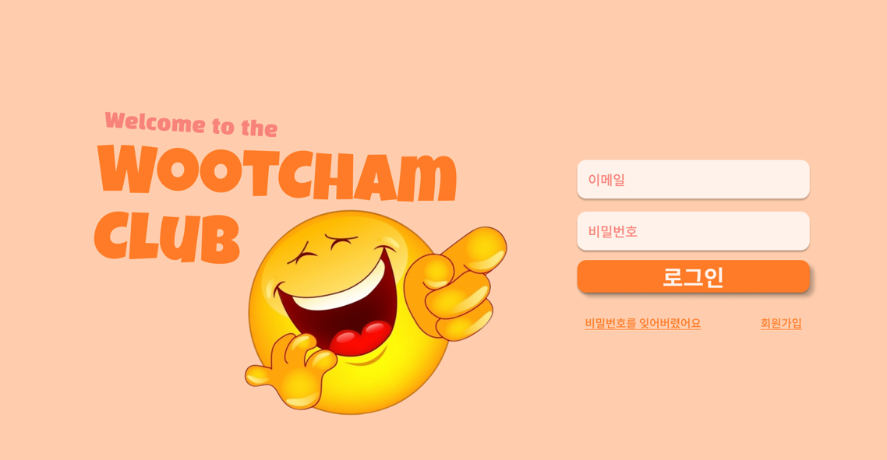
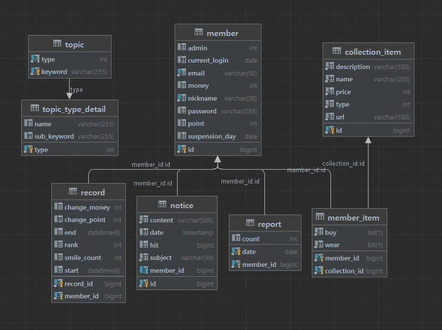
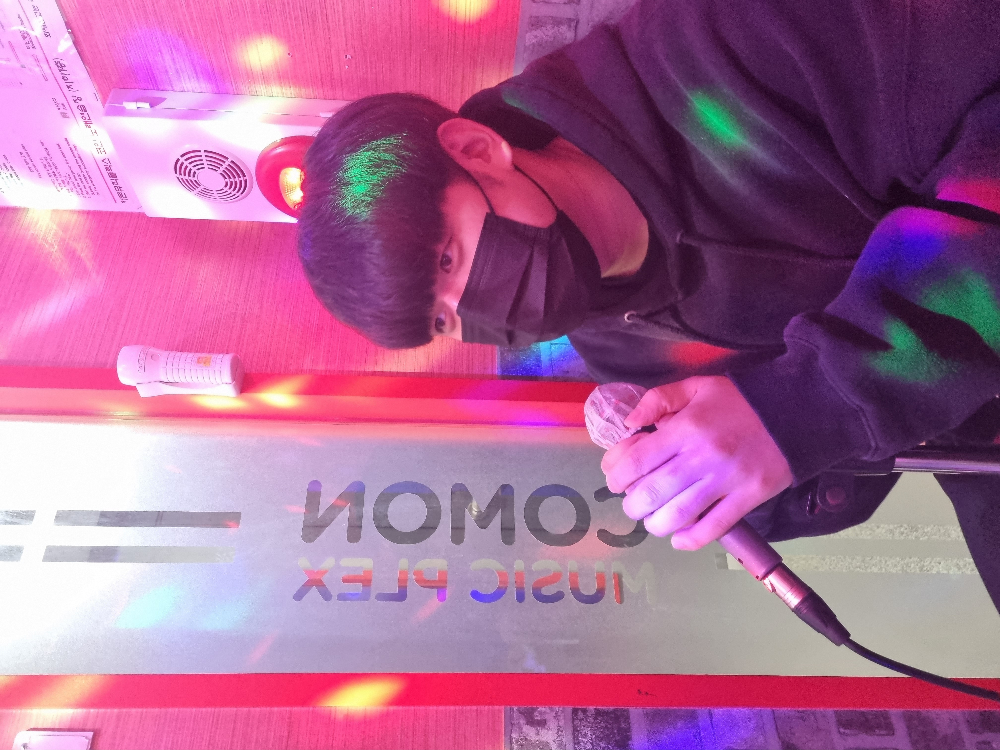
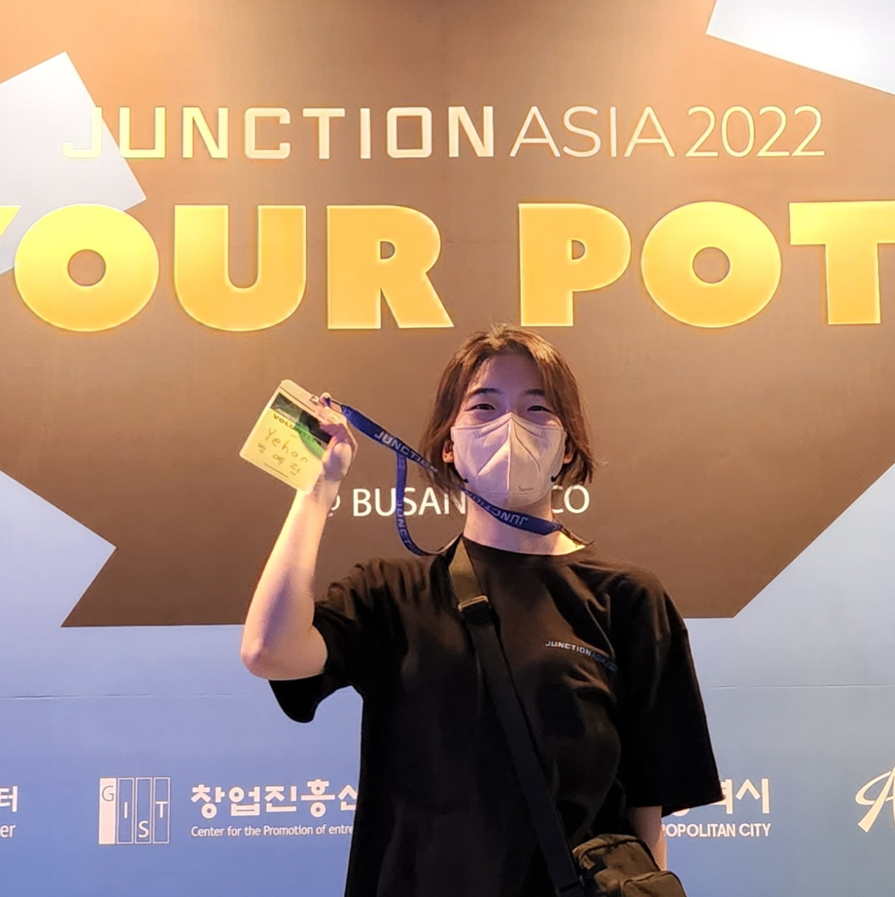
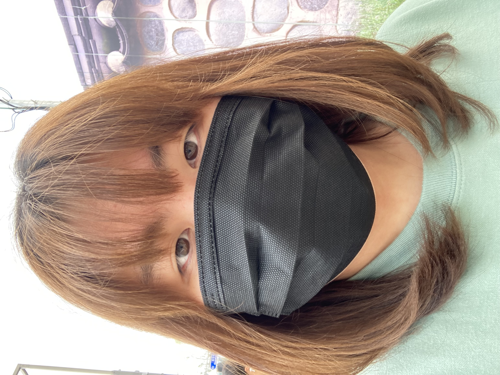
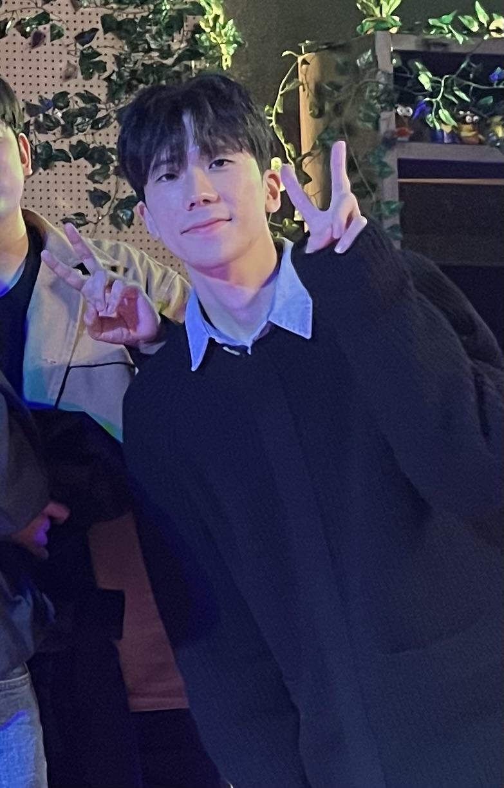
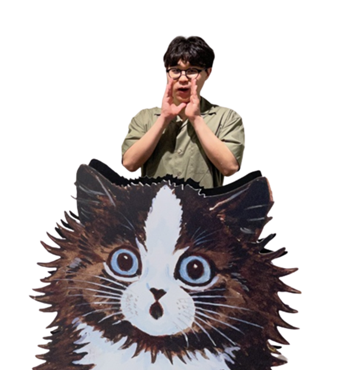

# 😄Woot Cham Club

## 🖥️ 1. 프로젝트 소개
OpenVidu와 faceAPI를 이용하여 화상채팅을 통해 게임을 진행하고, 웃은 횟수에 따라 점수를 부여해 서로 경쟁하는 게임 플랫폼입니다.
 

## 🕰️ 2. 개발 기간
* 23.07.10일 - 23.08.18일

## ⚙️ 3. 개발 환경

#### 💻 **IDE**
    - Intellij
    - Visual Studio Code

#### 🔧 **Backend**
    - Springboot 2.7.2
    - Java 11
    - Gradle 8.2.1
    - JPA
    - MySQL 8.1.0
    - Swagger
    - WebSocket

#### 🎨 **Frontend**
    - HTML, CSS
    - JavaScript
    - Vue 3.2.37
    - Node.js 16.16.0

#### 🚀 **배포**
    - AWS EC2
    - Ubuntu 20.04
    - Jenkins
    - Docker 20.10.17

#### 📊 **버전/이슈 관리**
    - Jira
    - GitLab

#### 🛠️ **Tool**
    - Postman
    - Figma

#### 🤝 **협업**
    - Mattermost
    - Notion

## 📐**4. 설계**

### 4-1. ERD

### 4-2. 시스템 아키텍처

## 📌 5. 주요 기능

### **5-1. 기본 UI**
#### 회원가입

#### 로그인

#### 로그아웃

#### 홈

#### 공지

#### 도감

#### 랭크

### **5-2. 게임 UI**
#### 게임 실행

## 🧑‍🤝‍🧑 5. 멤버 구성
|                                김석주                                 |                                박예한                                 |                                옥수빈                                 |                                왕준영                                 |                                이주용                                 |                                              임휘진                                              |
|:------------------------------------------------------------------:|:------------------------------------------------------------------:|:------------------------------------------------------------------:|:------------------------------------------------------------------:|:------------------------------------------------------------------:|:---------------------------------------------------------------------------------------------:|
|  |  |  |  |  |  |
|                      Back-end Api Server                       |                   Back-end Infra Api 서버                    |                           Front-end                            |                      Back-end Game Sever                       |                       Front-end                      |                                    Front-end                                   |

 
